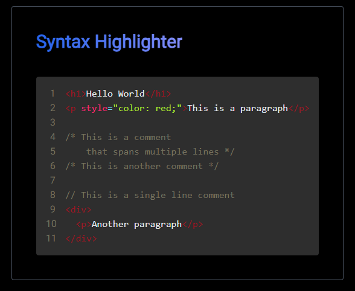

This is a [Next.js](https://nextjs.org) project.

# Syntax Highlighter

This projects provides code editor where HTML code will be highlighted.


## Implementation

The Code Editor consist from two parts:

- CodeBlock - it accepts some text and highlight it using Syntax Rules
- TextArea - Is Invisible and is overlapped on CodeBlock, it allows to edit the code, not effecting actual html.

```{jsx}
 <div className="relative">
    <CodeBlock code={code} className="relative" />
    <textarea
      value={code}
      onChange={handleChange}
      style={{ caretColor: syntaxConfig.caretColor }}
      className="ml-8 absolute top-0 left-0 w-full h-full bg-transparent text-transparent border-none outline-none font-mono text-base z-10 resize-none p-4"
    />
</div>
```

Project is build in a way that allows it to be simply modified and improved. Everything u need to change is:

- change/add colors
- change/add RegEx rules
- modify `.replace` functions in `CodeBlock` components

## Syntax Rules

| Rule                  | Regex                  | Description                                          |
| --------------------- | ---------------------- | ---------------------------------------------------- |
| Tags                  | `/&lt;(.*?)&gt;/g`     | Match everything between `<` and `>`                 |
| String (Double Quote) | `/&quot;(.*?)&quot;/g` | Match everything between double quotes               |
| String (Single Quote) | `/&#39;(.*?)&#39;/g`   | Match everything between single quotes               |
| Tag Attribute         | `/(\b\w+)=/g`          | Match every word followed by an equal sign           |
| Multiline Comments    | `/\/\* (.*?) \*\//gs`  | Match everything between `/*` and `*/`               |
| Comments              | `/\/\/(.*?)\n/g`       | Match everything after `//` till the end of the line |

All the rules stored in the object `syntaxRules`:

```{js}
const syntaxRules = {
  tags: /&lt;(.*?)&gt;/g,
  stringDoubleQuote: /&quot;(.*?)&quot;/g,
  stringSingleQuote: /&#39;(.*?)&#39;/g,
  tagAttribute: /(\b\w+)=/g,
  multilineComments: /\/\* (.*?) \*\//gs,
  comments: /\/\/(.*?)\n/g
}
```

## Colors

| Element     | Color     | Preview                                                                   |
| ----------- | --------- | ------------------------------------------------------------------------- |
| Background  | `#2e2e2e` | <div style="background-color:#2e2e2e; width: 100px; height: 20px;"></div> |
| Line Number | `#75715e` | <div style="background-color:#75715e; width: 100px; height: 20px;"></div> |
| Tags        | `#991622` | <div style="background-color:#991622; width: 100px; height: 20px;"></div> |
| String      | `#a6e22e` | <div style="background-color:#a6e22e; width: 100px; height: 20px;"></div> |
| Attribute   | `#f92672` | <div style="background-color:#f92672; width: 100px; height: 20px;"></div> |
| Punctuation | `#6ee4ff` | <div style="background-color:#6ee4ff; width: 100px; height: 20px;"></div> |
| Comments    | `#75715e` | <div style="background-color:#75715e; width: 100px; height: 20px;"></div> |
| Caret       | `#f0f`    | <div style="background-color:#f0f; width: 100px; height: 20px;"></div>    |

You can change colors in the object `syntaxConfig`:

```{js}
const syntaxConfig = {
  background: "#2e2e2e",
  lineNumberColor: "#75715e",
  tags: "#991622",
  stringColor: "#a6e22e",
  attributeColor: "#f92672",
  punctuationColor: "#6ee4ff",
  commentsColor: "#75715e",
  caretColor: "#f0f"
}
```
